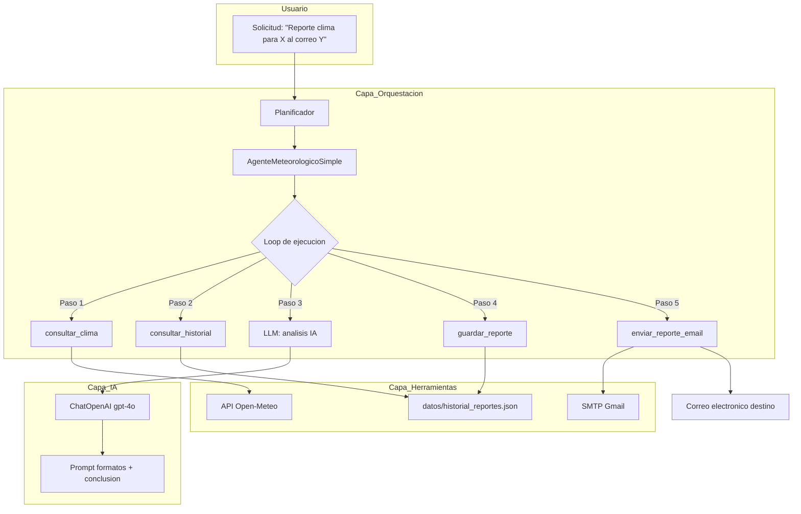

# AgenteClima - Agente Meteorológico Autónomo

Sistema agente inteligente para generación automatizada de reportes meteorológicos con envío por correo electrónico, construido sobre **LangChain** y **OpenAI (GitHub Models)**.

---

## Diagrama de Arquitectura



## Flujo de Trabajo

1. **Planificación**: El `Planificador` descompone la solicitud en 5 pasos secuenciados con dependencias
2. **Consulta climática**: Tool `consultar_clima` obtiene datos en vivo desde Open-Meteo
3. **Recuperación contextual**: Tool `consultar_historial` lee reportes previos con matching semántico
4. **Análisis con IA**: El LLM sintetiza datos actuales + históricos y genera recomendaciones
5. **Persistencia**: Tool `guardar_reporte` almacena el reporte en memoria JSON
6. **Entrega**: Tool `enviar_reporte_email` envía el HTML formateado por SMTP

## Justificación de Componentes

| Componente | Framework / Librería | Justificación |
|---|---|---|
| **LLM** | `langchain-openai` + GitHub Models (gpt-4o) | Acceso gratuito a modelos vía token GitHub; compatible con LangChain nativamente |
| **Framework agente** | `langchain-core` (BaseTool, ChatPromptTemplate, bind_tools) | Abstracciones maduras para definir tools con esquemas Pydantic y function calling |
| **Memoria persistente** | JSON + sistema de archivos | Sin dependencias externas; los reportes quedan disponibles entre ejecuciones |
| **Herramienta clima** | Open-Meteo API (gratuita, sin API key) | Datos meteorológicos en tiempo real con código WMO oficial |
| **Herramienta email** | `smtplib` (stdlib) + Gmail SMTP | Envío directo sin depender de servicios de terceros |
| **Planificación** | `herramientas/planificador.py` (dataclasses) | Descomposición dinámica de tareas con dependencias y prioridades |

## Ejemplos de Toma de Decisiones

### 1. Selección visual adaptativa por código WMO
```python
# En agente.py - obtener_configuracion_visual()
if wmo_code in [0, 1]:      # Despejado -> icono sol
    return assets["despejado"]
elif wmo_code in [2, 3]:     # Nublado -> icono nube
    return assets["nublado"]
elif wmo_code >= 51:         # Lluvia -> icono lluvia
    return assets["lluvia"]
```
El agente clasifica automáticamente las condiciones actuales usando la clasificación oficial de la Organización Meteorológica Mundial, y adapta el diseño visual del reporte (color de borde, fondo, icono).

### 2. Alerta de seguridad por viento
```python
# En el prompt de análisis IA
"REGLA CRÍTICA: Si la velocidad del viento supera los 40 km/h, incluye una alerta de seguridad explícita."
```
El LLM evalúa esta condición en cada ejecución y adapta sus recomendaciones al usuario.

### 3. Planificación dinámica de pasos
```python
# En herramientas/planificador.py
plan = Planificador().crear_plan(solicitud)
# Genera 5 pasos secuenciados con dependencias:
# 1. consultar_clima (prioridad 1, sin deps)
# 2. consultar_historial (prioridad 1, sin deps)
# 3. analizar_datos (prioridad 2, deps: paso 1 y 2)
# 4. guardar_reporte (prioridad 2, deps: paso 3)
# 5. enviar_reporte_email (prioridad 3, deps: paso 4)
```

## Configuración y Ejecución

1. Clonar el repositorio
2. Crear archivo `.env` basado en el siguiente template:
```env
OPENAI_BASE_URL="https://models.inference.ai.azure.com"
GITHUB_TOKEN="tu_token_github"
SMTP_SERVER="smtp.gmail.com"
SMTP_PORT=587
EMAIL_REMITENTE="tu_correo@gmail.com"
EMAIL_PASSWORD="tu_password_app"
```
3. Instalar dependencias: `pip install -r requirements.txt`
4. Ejecutar: `.\.venv\Scripts\python.exe src\app.py` o `.\scripts\iniciar.ps1`
5. Abrir: `http://localhost:5000`

## Estructura del Proyecto

```
Agente-Clima/
├── src/
│   ├── app.py                      # Servidor Flask (API + frontend)
│   ├── agente.py                   # Orquestación principal del agente
│   └── comunas.py                  # Catálogo de comunas (Los Lagos)
├── herramientas/
│   ├── clima.py                    # Tool: consulta Open-Meteo API
│   ├── detector_embedding.py       # Detector semántico de contenido malicioso
│   ├── email_sender.py             # Tool: envío SMTP
│   ├── historial.py                # Tools: guardar/consultar historial JSON
│   ├── monitoreo.py                # Logging, métricas y trazas
│   ├── planificador.py             # Planificación y descomposición de tareas
│   ├── recomendaciones.py          # Tool: recomendaciones según clima
│   └── seguridad.py                # Validación, filtro ético, rate limiting
├── static/                         # CSS, JS, imágenes del frontend
├── templates/                      # Plantillas HTML (Jinja2)
├── datos/                          # Datos JSON persistentes
├── logs/                           # Logs de ejecución
├── scripts/                        # Scripts de utilidad
├── docs/                           # Documentación y recursos
├── .env                            # Variables de entorno (no versionado)
├── requirements.txt                # Dependencias Python
└── BITACORA.md                     # Historial completo del proyecto
```

## Referencias

- LangChain Documentation. (2024). *Agents*. https://python.langchain.com/docs/modules/agents/
- OpenAI. (2024). *Function Calling Guide*. https://platform.openai.com/docs/guides/function-calling
- Open-Meteo. (2024). *Weather API*. https://open-meteo.com/en/docs
- Organización Meteorológica Mundial. (2024). *WMO Weather Codes*. https://www.nodc.noaa.gov/archive/arc0021/0002199/1.1/data/0-data/HTML/WMO-CODE/WMO4677.HTM
- CrewAI. (2025). *Documentation*. https://docs.crewai.com/
